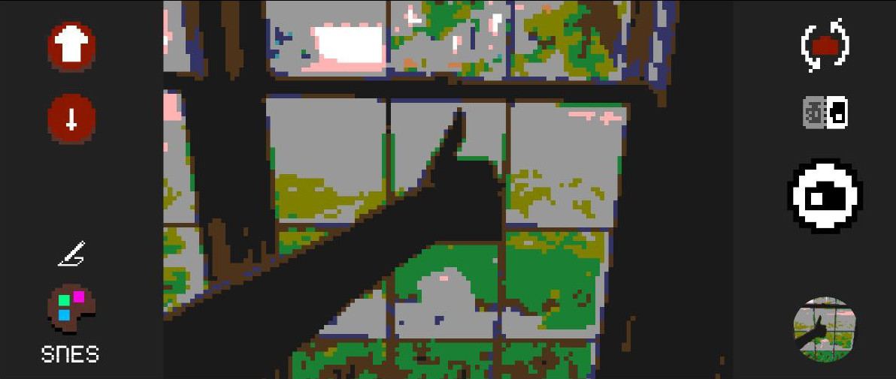
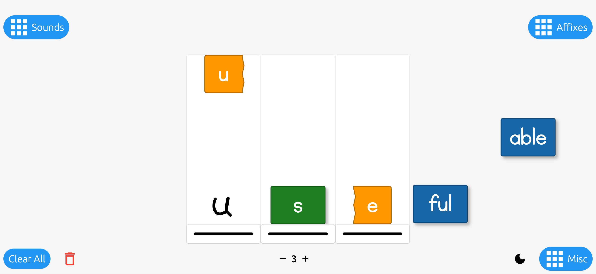

# Cognichine Support

Cognichine is a micro business entity dedicated to releasing innovative, tech-driven projects. Founded by Derek Scherer, an independent engineer, Cognichine focuses on projects that embody ideals and push the boundaries of technology.

## Projects Overview

### Retro Pixel Camera

[Retro Pixel Camera Support Page](https://github.com/Dayruke/Cognichine-Support/blob/main/Retro-Pixel-Camera/Retro-Pixel-Camera.md)

Transforms your camera feed into a nostalgic pixel art style in real-time.

### RiL Letter Tiles

[RiL Letter Tiles Support Page](https://github.com/Dayruke/Cognichine-Support/blob/main/RiL_Letter_Tiles/RiL_Letter_Tiles.md)

Create and manipulate letter tiles in a 3D space, bringing a new dimension to word games.

### Proportia

[Proportia Support Page](https://github.com/Dayruke/Cognichine-Support/blob/main/Proportia/Proportia.md)

Visualize numerical proportions. Simple, fast number sense.

## About Derek Scherer

Learn more about me at [derekscherer.com](http://derekscherer.com).