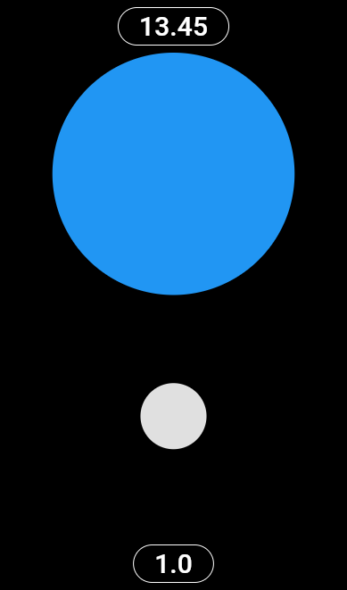

# Cognichine Support

Cognichine is a micro business entity dedicated to releasing innovative, tech-driven projects. Founded by Derek Scherer, an independent engineer, Cognichine focuses on projects that embody ideals and push the boundaries of technology.

## Projects Overview

### Proportia

[Proportia Support Page](https://github.com/Dayruke/Cognichine-Support/blob/main/Proportia/Proportia.md)

Visualize numerical proportions. Simple, fast number sense.  

### Upcoming Projects

- **Retro Pixel Camera:** Capture nostalgia with Retro Pixel Camera.

Stay tuned for updates!

## About Derek Scherer

Learn more about me at [derekscherer.com](http://derekscherer.com).